<!--
GitHub profile README for Thomas de Chillaz.
Animated assets live in ./assets and are designed to render directly on GitHub.
-->

<div align="center">
  

  <br />
  <br />

  <a href="https://github.com/ThomasdeChillaz?tab=repositories">
    
  </a>
  <a href="https://www.linkedin.com/in/thomas-de-chillaz-9382b62a0/">
    
  </a>
  <a href="https://compbio.mit.edu/">
    
  </a>

  <br />
  <br />

  <strong>Computational biology, oncology, and healthcare AI - built with evaluation first.</strong>
</div>

---



## Current Coordinates

I build research systems that move from biological signal to validated representation to reviewable healthcare use.

```text
biological question
  -> leakage-resistant data
  -> representation / model / agent
  -> uncertainty-aware evaluation
  -> scientific interpretation
  -> governed healthcare workflow
```

<table>
<tr>
<td width="50%" valign="top">

### Single-cell evaluation systems

Benchmarking infrastructure for single-cell methods and biological foundation models.

- Typed task contracts, adapters, metrics, and reports
- Multi-seed execution and deterministic scoring
- Annotation, integration, perturbation, transfer, and retrieval tasks
- Splits designed to expose leakage across gene family, species, modality, and time

</td>
<td width="50%" valign="top">

### Multimodal oncology

Research combining pathology foundation-model embeddings with clinical variables for censored survival analysis.

- TCGA-BRCA whole-slide images and paired clinical records
- Frozen pathology embeddings with leakage-controlled covariates
- Survival ensembles, concordance evaluation, and bootstrap uncertainty
- Explicit treatment of censoring, event scarcity, and clinical limits

</td>
</tr>
<tr>
<td width="50%" valign="top">

### Dynamic biological maps

Methods for embeddings that remain interpretable as biological data changes over time.

- Streaming UMAP-style state
- Temporal neighborhood updates and inertial anchoring
- Separation of projection motion from biological structure
- Drift, rotation, and topology-change benchmarks

</td>
<td width="50%" valign="top">

### Governed healthcare intelligence

The systems layer behind Mantis: secure intelligence for fragmented hospital data and workflows.

- Read-only connectors, FHIR R4 mapping, and de-identification
- Joint representations across records, labs, imaging, and notes
- Typed knowledge graphs with provenance and permissions
- Bounded agents, human approval, audit trails, and rollback

</td>
</tr>
</table>

---

## Research @ MIT CSAIL

<a href="https://compbio.mit.edu/">
  
</a>

I work in computational biology with Manolis Kellis's group at MIT CSAIL, alongside my undergraduate studies in Artificial Intelligence, Data & Management at CentraleSupelec x ESSEC.

My work sits between research engineering and scientific investigation: turning biological questions into reproducible datasets, evaluation contracts, model pipelines, and interfaces that make results inspectable end to end.

---

## Public Work

| Repository | Focus |
|---|---|
| [EEG Sleep-State Classifier](https://github.com/ThomasdeChillaz/EEG-Sleep-State-Classifier) | EEG-based sleep-state modeling and classification |
| [Lung Cancer Classifier](https://github.com/ThomasdeChillaz/Lung-Cancer-Classifier) | EfficientNetB0 image classification applied to lung-cancer imagery |
| Research systems in progress | Single-cell benchmarking, multimodal oncology, dynamic representations, and governed healthcare intelligence |

---

## Pull Request Pulse

Pull requests are the public trace of experiments, evaluations, interfaces, and fixes moving from build to review to merge.

<a href="https://github.com/pulls?q=is%3Apr+author%3AThomasdeChillaz+sort%3Aupdated-desc">
  
</a>

<p align="center">
  <sub>Rendered by this profile repository's own GitHub Action. No external profile-stat service.</sub>
</p>

---

## Stack

<p align="center">
  <code>Python</code>
  <code>PyTorch</code>
  <code>Scanpy</code>
  <code>AnnData</code>
  <code>scikit-learn</code>
  <code>UMAP</code>
  <code>Pydantic</code>
  <code>React</code>
  <code>TypeScript</code>
  <code>Docker</code>
  <code>FHIR R4</code>
</p>

---

## Operating Principles

> A model is only as credible as its split, uncertainty, failure modes, and path to use.

- Evaluation before claims.
- Original-space validation before visual certainty.
- Transfer over memorization.
- Governance as a technical requirement, not a policy footnote.

<br />

<div align="center">
  <strong>French-American - AIDAMS @ CentraleSupelec x ESSEC - Computational Biology @ MIT CSAIL</strong>
  <br />
  <sub>Building research that survives contact with biology and healthcare.</sub>
</div>
