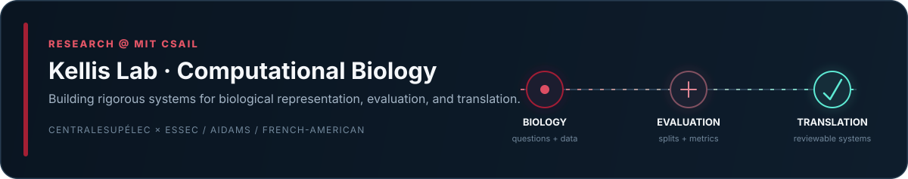
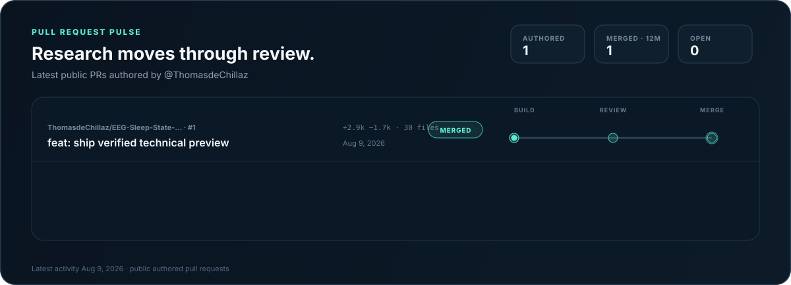

<!--
Healthcare-focused GitHub profile for Thomas de Chillaz.
The animated pull-request panel is generated by:
.github/workflows/update-pr-activity.yml
-->

<div align="center">
  

  <br />

  <a href="https://github.com/ThomasdeChillaz?tab=repositories">
    
  </a>
  <a href="https://www.linkedin.com/in/thomas-de-chillaz-9382b62a0/">
    
  </a>
</div>

<br />

<p align="center">
  <strong>I build research systems that move from biological signal → validated representation → clinically governed use.</strong>
</p>

---

## Research @ MIT CSAIL

<a href="https://compbio.mit.edu/">
  
</a>

I work in **computational biology with Manolis Kellis’s group at MIT CSAIL**, alongside my undergraduate studies in **Artificial Intelligence, Data & Management at CentraleSupélec × ESSEC**.

My work sits between research engineering and scientific investigation: I turn biological questions into reproducible datasets, evaluation contracts, model pipelines, and interfaces that make the result inspectable end to end.

```text
biological question
        ↓
locked data + leakage-resistant split
        ↓
representation / model / agent
        ↓
reproducible evaluation + uncertainty
        ↓
scientific interpretation
        ↓
governed healthcare use
```

---

## What I am building

<table>
<tr>
<td width="50%" valign="top">
<h3>01 · Single-cell evaluation systems</h3>
<p>Infrastructure for testing single-cell methods and biological foundation representations without reducing the result to one convenient score.</p>
<ul>
<li>Typed benchmark contracts, adapters, metrics, and reports</li>
<li>Multi-seed execution, deterministic scoring, and failure flags</li>
<li>Annotation, integration, perturbation, transfer, and retrieval tasks</li>
<li>Leakage-resistant splits across gene family, species, modality, and time</li>
</ul>
<p><strong>Goal:</strong> measure what a representation enables—not what it memorized.</p>
</td>
<td width="50%" valign="top">
<h3>02 · Multimodal oncology</h3>
<p>Research combining pathology foundation-model embeddings with clinical variables for censored survival analysis in breast cancer.</p>
<ul>
<li>TCGA-BRCA whole-slide images and paired clinical records</li>
<li>Frozen pathology embeddings and leakage-controlled covariates</li>
<li>Survival ensembles, concordance evaluation, and bootstrap uncertainty</li>
<li>Explicit treatment of censoring, low event counts, and clinical limits</li>
</ul>
<p><strong>Status:</strong> ongoing research moving toward publication; not a clinical device.</p>
</td>
</tr>
<tr>
<td width="50%" valign="top">
<h3>03 · Dynamic biological representations</h3>
<p>Methods for maps that remain meaningful when high-dimensional biological data changes over time.</p>
<ul>
<li>Persistent state for streaming UMAP-style embeddings</li>
<li>Temporal neighborhood updates and inertial anchoring</li>
<li>Separation of projection motion from structural motion</li>
<li>Benchmarks for gradual drift, rotation, and topology change</li>
</ul>
<p><strong>Use case:</strong> cell-state trajectories, longitudinal cohorts, and evolving model spaces.</p>
</td>
<td width="50%" valign="top">
<h3>04 · Governed healthcare intelligence</h3>
<p>The technical foundations behind <strong>Mantis</strong>: a secure operating layer for fragmented hospital data and workflows—not another chatbot.</p>
<ul>
<li>Read-only connectors, FHIR R4 mapping, and de-identification</li>
<li>Joint representations across records, labs, imaging, and notes</li>
<li>Typed knowledge graphs with provenance and permissions</li>
<li>Bounded agents, human approval, auditability, and rollback</li>
</ul>
<p><strong>Goal:</strong> connect evidence to reviewable decisions without hiding the path.</p>
</td>
</tr>
</table>

---

## Pull requests in motion

Pull requests are the public trace of the work changing: experiments, evaluations, interfaces, and fixes moving from **build → review → merge**.

<a href="https://github.com/pulls?q=is%3Apr+author%3AThomasdeChillaz+sort%3Aupdated-desc">
  
</a>

<p align="center">
  <sub>Generated from the GitHub API by this repository’s own workflow. No external profile-stat service.</sub>
</p>

---

## Selected public work

| Repository | Research focus |
|---|---|
| **[EEG Sleep-State Classifier](https://github.com/ThomasdeChillaz/EEG-Sleep-State-Classifier)** | EEG-based sleep-state modeling and classification |
| **[Lung Cancer Classifier](https://github.com/ThomasdeChillaz/Lung-Cancer-Classifier)** | EfficientNetB0-based image classification applied to lung-cancer imagery |
| **Research systems in progress** | Single-cell benchmarking, multimodal oncology, dynamic biological representations, and governed healthcare intelligence |

---

## Research principles

> **A model is only as credible as its split, uncertainty, failure modes, and path to use.**

- **Evaluation before claims.** Reproducibility, leakage control, and uncertainty are part of the method.
- **Original-space validation.** A compelling UMAP is a view of the data—not proof about the data.
- **Utility over memorization.** Foundation representations should transfer to real biological tasks.
- **Governance is technical.** Permissions, provenance, review, and rollback belong inside healthcare system design.

---

## Working stack

<p align="center">
  <code>Python</code> ·
  <code>PyTorch</code> ·
  <code>Scanpy</code> ·
  <code>AnnData</code> ·
  <code>scikit-learn</code> ·
  <code>UMAP</code> ·
  <code>Pydantic</code> ·
  <code>React</code> ·
  <code>TypeScript</code> ·
  <code>Docker</code> ·
  <code>FHIR R4</code>
</p>

---

## Current direction

- Completing a full, reproducible evaluation suite for single-cell methods and biological foundation models.
- Turning benchmarking into an environment where agents can construct, test, and improve analysis pipelines.
- Advancing multimodal oncology work while keeping uncertainty and clinical validity explicit.
- Designing healthcare systems around real interoperability, privacy, governance, and deployment constraints.

<br />

<div align="center">
  <strong>French-American · AIDAMS @ CentraleSupélec × ESSEC · Computational Biology @ MIT CSAIL</strong>
  <br />
  <sub>Building research that survives contact with biology—and healthcare.</sub>
</div>
